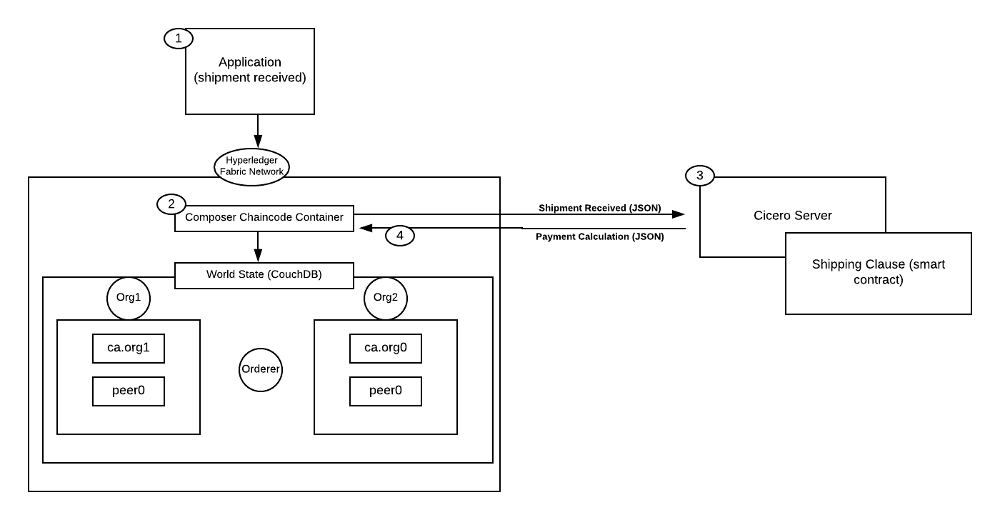
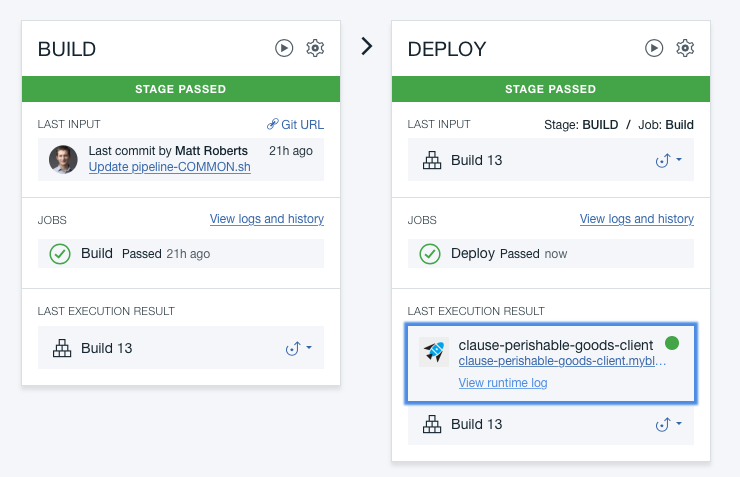

# Clause Sample for IBM Blockchain Platform

Legal Contracts are the foundation of the exchange of value between humans.  As most things become digitized, so are contracts. Blockchain is transforming the exchange of assets to a model based on a business network using a distributed ledger.  This model requires that we establish governing rules for digital asset exchanges; hence the idea of smart contracts was born. The [Accord Project](https://accordproject.org/) is an open source software initiative that has established specifications, tooling and code for smart legal contracts.  

The [Clause platform](http://clause.io) manages digital legal contracts that adhere to the [Accord Project open-source specifications](https://docs.accordproject.org) for [smart legal contracts](https://medium.com/@Clause/really-smart-and-legal-contracts-a77fcd1d0d10)

This code pattern illustrates how a legal agreement (such as a shipping contract) can be automated with the use of trusted data from the IBM Blockchain Platform. In this scenario, the Hyperledger Composer business network (executing on Hyperledger Fabric v1) invokes the Clause platform. Hyperledger Fabric stores the state of assets on the blockchain, while the [Cicero engine](https://github.com/accordproject/cicero) (from the Accord Project) executes contract logic off-chain on the [Clause platform](http://clause.io). 

The developer creates a blockchain-based business network on the IBM Blockchain Platform that invoke Clause to execute Smart Legal Contracts. When the reader has completed this code pattern, they will understand how to:
* Deploy a network to IBM Blockchain Starter Plan
* Configure and use the Clause platform to build and execute a contract
* Run an Angular application that utilizes the Clause smart contract

## Architecture Flow
<!--Remember to dump an image in this path-->

1. Application receives a shipment request
2. A transaction is submitted to IBM Blockchain Platform
3. A call is issued to Clause to trigger execution of a smart legal contract
4. The smart legal contract is executed and assuming verifications pass; then a payment is subsequently calculated
5. Assets on the blockchain are updated: blocks are written to the network and the world state is updated

## Included Components
* [Hyperledger Composer v0.20.x](https://hyperledger.github.io/composer/latest/) Hyperledger Composer is an extensive, open development toolset and framework to make developing blockchain applications easier
* [Hyperledger Fabric v1.2.1](https://hyperledger-fabric.readthedocs.io) Hyperledger Fabric is a platform for distributed ledger solutions, underpinned by a modular architecture delivering high degrees of confidentiality, resiliency, flexibility and scalability.
* [IBM Blockchain Starter Plan](https://console.bluemix.net/catalog/services/blockchain) The IBM Blockchain Platform Starter Plan allows to build and try out blockchain network in an environment designed for development and testing
* [Clause](http://clause.io) Clause edits and executes smart legal contracts, connecting them to existing event sources and systems

## Featured Technologies
* [Clause](https://clause.io)
* [Angular](https://angular.io/)

## Prerequisites
1. If you do not have an IBM Cloud account yet, you will need to create one [here](https://ibm.biz/BdjLxy).

## Steps
1. [Provision IBM Blockchain Starter Plan](#1-provision-ibm-blockchain-starter-plan)
2. [Deploy to IBM Cloud](#2-deploy-to-ibmcloud)
3. [Setup Smart Legal Contract](#3-setup-smart-legal-contract)
4. [Running the Client Application](#4-running-the-client-application)

## Step 1. Provision IBM Blockchain Starter Plan

## Step 2. Deploy to IBM Cloud

A. Click the link below to automate the provision of a service on IBM Cloud and to deploy the contract and app contained in this repository.

B. Authorize IBM Cloud to access your GitHub account. This sample will be forked into your account so you can modify it.

C. In the `Delivery Pipeline` tab under `Tool Integrations`. Enter your IBM Cloud API Key. If you don't have a key you can create one. Enter the service name of your Blockchain instance from your IBM Cloud dashboard, it will be something like `Blockchain-xy`.

D. Click `Create` to trigger the deployment, then click 'Delivery Pipeline' to monitor to progress. Wait for both the 'Build' and 'Deploy' stages to pass, this should take about 10 minutes.

> Note that if deploy fails you should check the logs. If you have an existing Cloudant Lite plan instance the deploy will fail, as each IBM Cloud account is limited to a single Cloudant Lite plan database instance. You must upgrade your existing Cloudant instance to a paid plan or remove it.

## Step 3. Setup Smart Legal Contract

While you are waiting you can get started with [setting up your Smart Legal Contract on Clause](https://clause.elevio.help/en/articles/48). In that link, begin with Step 3.

## Step 4. Running the Client Application

You can read more about the Client Application [here](https://github.com/clauseHQ/demo-clause-ibm-perishable-goods/blob/master/apps/clause-perishable-goods-client/README.md).

Click the Client App link under 'LAST EXECUTION RESULT' to view your demonstration app, it should look like the screenshot at the top of this page. Note that Hyperledger Composer is used to store the state of shipments, importers, growers, shippers on the blockchain, while the contract logic is invoked out-of-process using the Cicero Server.  Follow the instructions

# Links

* [IBM Blockchain - Marbles demo](https://github.com/IBM-Blockchain/marbles)
* [Hyperledger Composer](https://hyperledger.github.io/composer/latest/index.html)

# Learn more

* **Blockchain Code Patterns**: Enjoyed this Code Pattern? Check out our other [Blockchain Code Patterns](https://developer.ibm.com/code/technologies/blockchain/)

* **Blockchain 101**: Learn why IBM believes that blockchain can transform businesses, industries – and even the world. [Blockchain 101](https://developer.ibm.com/code/technologies/blockchain/)

* **How to integrate Clause with Blockchain**: Learn about the 4 ways you can integrate Smart Legal Contracts from Clause with Blockchain. [Integrate Clause with Blockchain](https://clause.elevio.help/en/articles/11)

# License
This code pattern is licensed under the Apache Software License, Version 2. Separate third party code objects invoked within this code pattern are licensed by their respective providers pursuant to their own separate licenses. Contributions are subject to the Developer [Certificate of Origin, Version 1.1 (“DCO”)] (https://developercertificate.org/) and the [Apache Software License, Version 2]( (http://www.apache.org/licenses/LICENSE-2.0.txt).

ASL FAQ link: http://www.apache.org/foundation/license-faq.html#WhatDoesItMEAN

&copy; Copyright 2018, Clause Inc.
