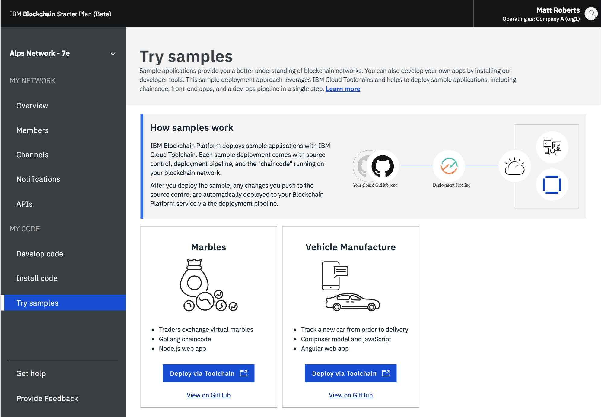

# Clause Sample for IBM Blockchain Platform

This demonstration illustrates how a legal agreement (such as a shipping contract) can be automated with the use of trusted data from the IBM Blockchain Platform.

The [Clause platform](https://clause.io) provides tooling to manage commercial contracts that adhere to the [open-source standard](https://accordproject.org) for [smart legal contracts](https://medium.com/@Clause/really-smart-and-legal-contracts-a77fcd1d0d10)

## Running this sample

### If you already have an IBM Blockchain Platform service ...

Choose this sample from the tiles in the Samples Gallery of your IBM Blockchain Platform instance. 

### Otherwise

Click the button below to automate the provision of a service on IBM Cloud and to deploy the contract and app contained in this repository.

> :warning: Toolchain icon not yet ready

&copy; Copyright 2018, Clause Inc. 
